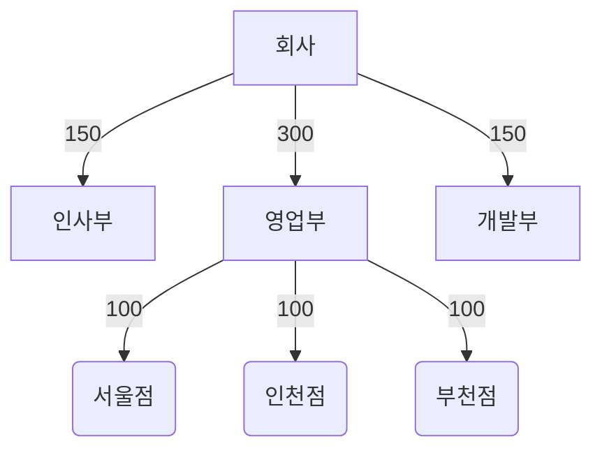

Here is one mermaid diagram:
<div class="mermaid">
  graph TD
  A[Client] --> B[Load Balancer]
  B --> C[Server1]
  B --> D[Server2]
</div>

And here is another:
<div class="mermaid">
  graph TD
  A[Client] -->|tcp_123| B(Load Balancer)
  B -->|tcp_456| C[Server1]
  B -->|tcp_456| D[Server2]
</div>
This formula $f(x) = x^2$ is an example

This formula $f(x) = x^2$ is an example.

This formula $f(x) = x^2$ is an example

```
$$
\lim_{x\to 0}{\frac{e^x-1}{2x}}
\overset{\left[\frac{0}{0}\right]}{\underset{\mathrm{H}}{=}}
\lim_{x\to 0}{\frac{e^x}{2}}={\frac{1}{2}}
$$
```


<div class="mermaid">
  graph TD
  A[Company] --> |150| B[Human Resource Department]
  A --> |300| C[Sales Department]
  A --> |150| D[Development Department]
  C --> |100| E(Seoul Store)
  C --> |100| F(Incheon Store)
  C --> |100| H(Bucheon Store)
</div>



<div class="mermaid">
  graph TD
  A[(Company)] --> B[(Human Resource Department)]
  A --> C[(Sales Department)]
  A --> D[(Development Department)]
  C --> E(Seoul Store)
  C --> F(Incheon Store)
  C --> H(Bucheon Store)

```mermaid
graph BT 
subgraph Stackframe
	subgraph A
		1-1("F(4)") --- 101("Top") 
	end
	subgraph two
		2-1("F(4)") --- 2-2("F(3)") --- 102("Top") 
	end 
	subgraph three
		3-1("F(4)") --- 3-2("F(3)") --- 3-3("F(2)") --- 103("Top") 
	end 
	subgraph four
		4-1("F(4)") --- 4-2("F(3)") --- 4-3("F(2)") --- 4-4("F(1)") --- 104("Top") 
  end 
  subgraph five
	  5-1("F(4)") --- 5-2("F(3)") --- 5-3("F(2)") --- 5-4("F(0)") --- 105("Top") 
  end 
  subgraph six
	  6-1("F(4)") --- 6-2("F(3)") --- 6-3("F(2)") --- 106("Top") 
  end 
  subgraph seven
	  7-1("F(4)") --- 7-2("F(3)") --- 107("Top") 
  end 
  subgraph eight
	  8-1("F(4)") --- 108("Top") 
  end
  subgraph nine 
	  109("Top") 
  end
end 
```

</div>





<div class="mermaid">
  graph TD
  A[(Company)] --- B[(test)]
</div>


<div class="mermaid">
  graph LR
  id1[(Database)]
</div>


