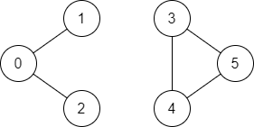

# [문제]([https://leetcode.com/problems/find-if-path-exists-in-graph/](https://leetcode.com/problems/find-if-path-exists-in-graph/))

There is a **bi-directional** graph with `n` vertices, where each vertex is labeled from `0` to `n - 1` (**inclusive**). The edges in the graph are represented as a 2D integer array `edges`, where each `edges[i] = [ui, vi]` denotes a bi-directional edge between vertex `ui` and vertex `vi`. Every vertex pair is connected by **at most one** edge, and no vertex has an edge to itself.

You want to determine if there is a **valid path** that exists from vertex `source` to vertex `destination`.

Given `edges` and the integers `n`, `source`, and `destination`, return `true` *if there is a **valid path** from* `source` *to* `destination`*, or* `false` *otherwise.*

[문제해석]

n개의 노드와 노드와 노드 사이 연결인 edge가 주어지고, source(시작점)와 destination(목적지)가 주어졌을때 시작점에서 목적지로 갈 수 있는지 True/False로 리턴하시오.

### example 1:

```
Input: n = 3, edges = [[0,1],[1,2],[2,0]], source = 0, destination = 2
Output: true
Explanation: There are two paths from vertex 0 to vertex 2:
- 0 → 1 → 2
- 0 → 2
```

### example 2:



```
Input: n = 6, edges = [[0,1],[0,2],[3,5],[5,4],[4,3]], source = 0, destination = 5
Output: false
Explanation: There is no path from vertex 0 to vertex 5.
```

### 제한조건

- `1 <= n <= 2 * 105`
- `0 <= edges.length <= 2 * 105`
- `edges[i].length == 2`
- `0 <= ui, vi <= n - 1`
- `ui != vi`
- `0 <= source, destination <= n - 1`
- There are no duplicate edges.
- There are no self edges.

# [풀이]

1. bi-directional linked list 만들기
2. 리스트 삽입
3. 리스트를 통한 유효 경로 탐색

```python
class Solution:
    def validPath(self, n: int, edges: List[List[int]], source: int, destination: int) -> bool:
			
			dict = {}
			#자신의 양옆에 있는 노드를 딕셔너리 형태로 저장
			for i in range(n): #[[0,1],[1,2],[2,0]]
				dict[i] = [] #{0:[],1:{},2:[]]

			#bi-directional 형태이기 때문에 이를 활용한 양쪽 방향 노드 번호 저장
			for k in edges:
				dict[k[0]].append(k[1])
				dict[k[1]].append(k[0]]

			#각 노드의 양쪽이 저장된 딕셔너리에 source와 destination이 있는지 탐색
			k = [False] * n
			value = 
			q = [source]
			while q:
				
				#q에는 탐색할 형태의 label만 저장
				value = q.pop(0)

				for i in range(len(dict[value])):
				#살펴보지 않은 경우에 대해서만 큐 요소 추가
				#BFS 방식 - 모든 경우의 수를 너비만큼 보면서 사이클이 없는 경우까지 탐색가능
					if k[value] == False:
						q,append(dict[value][i])
						k[value] = True

				
				if destination in q:
					return True

			return False
```

# [배운점]

- 자료구조의 한 형태으 큐(first-in-first-out)를 사용하는 법
- 모든 경우의 수를 다 살펴보는 알고리즘: 부르트포스 알고리즘, DFS(stack, 재귀함수 사용), BFS(queue 사용)
- 유사문제: [https://leetcode.com/problems/keys-and-rooms/description/](https://leetcode.com/problems/keys-and-rooms/description/)
